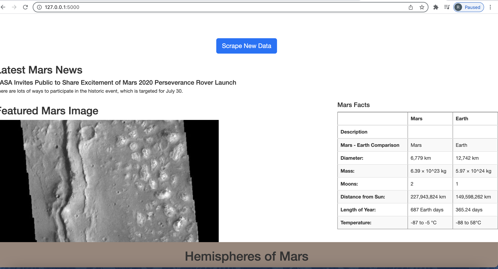
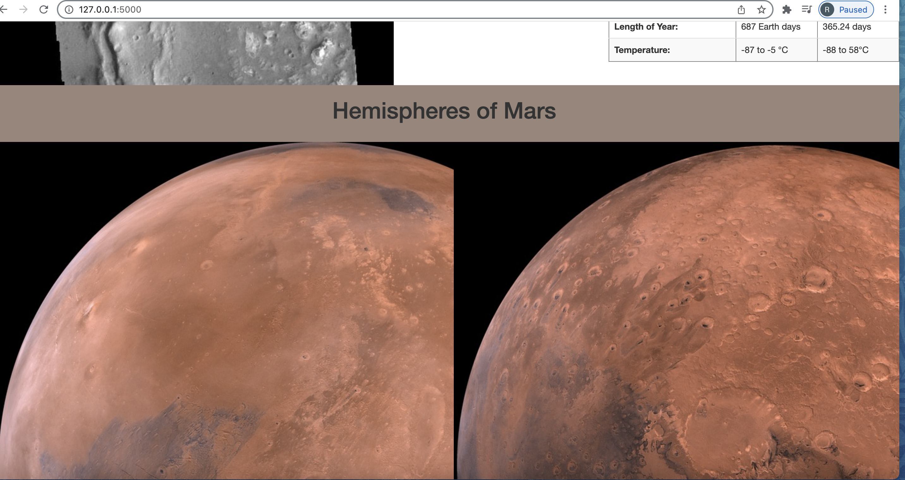

# Mission-to-Mars

## Purpose 
Use BeautifulSoup, Splinter, and Pandas to scrape different webpages related to Mars, and display the results on a webpage using MongoDB and Flask.
## Background
> The cliente would like to adjust the current web app to include all four of the hemisphere images. Using BeautifulSoup and Splinter to scrape full-resolution images of Mars’s hemispheres and the titles of those images, I will store the scrape data on a Mongo database, use a web application to display the data, and alter the design of the web app to accommodate these images.
## Overview
> Deliverable 1: Scrape Full-Resolution Mars Hemisphere Images and Titles

> Deliverable 2: Update the Web App with Mars Hemisphere Images and Titles

> Deliverable 3: Add Bootstrap 3 Components
### Deliverable 1:

1. Visit the Mars Hemispheres website to view the hemisphere images.
The Mars hemisphere webpage
2. Use the DevTools to inspect the page for the proper elements to scrape. You will need to retrieve the full-resolution image for each of Mars's hemispheres.
3. Create a list to hold the .jpg image URL string and title for each hemisphere image.
4. Write code to retrieve the full-resolution image URL and title for each hemisphere image. The full-resolution image will have the .jpg extension.
5. Loop through the full-resolution image URL, click the link, find the Sample image anchor tag, and get the href.
6. Save the full-resolution image URL string as the value for the img_url key that will be stored in the dictionary you created from the Hint.
7. Save the hemisphere image title as the value for the title key that will be stored in the dictionary you created from the Hint.
8. Before getting the next image URL and title, add the dictionary with the image URL string and the hemisphere image title to the list you created in Step 2.
9. Print the list of dictionary items. Your list should look like the following image:

### Deliverable 2:

1. In the def scrape_all() function in your scraping.py file, create a new dictionary in the data dictionary to hold a list of dictionaries with the URL string and title of each hemisphere image.
2. Below the def mars_facts() function in the scraping.pyfile, create a function that will scrape the hemisphere data by using your code from the Mission_to_Mars_Challenge.py file. At the end of the function, return the scraped data as a list of dictionaries with the URL string and title of each hemisphere image.
3. Run the app.py file, then check your Mongo database to make sure that you are retrieving all of the data.
4. Modify the index.html file to access your database, and retrieve the img_url and title as you loop through the dictionary in the database using . The dictionary in the mars hemispheres database is the dictionary that was created from the Hint after Step 3 in Deliverable 1.
5. If you’d like a hint on coding the syntax for rendering Mongo database objects in your index.html file, that’s totally okay. If not, that’s great too. You can always revisit this later if you change your mind.
6. Run the app.py file, open the index.html file, and click the "Scrape New Data" button.

### Deliverable 3:
> 1. Use the Bootstrap 3 grid system (Links to an external site.) examples to update your index.html file so your website is mobile-responsive. Use the DevTools to test the responsiveness of your website.
> 2. Add two other Bootstrap 3 components from this list (Links to an external site.). Examples include:
* Styling the "Scrape New Data" button.
* Customizing the facts table.
* Adding the hemisphere images as thumbnails, like the image below.

